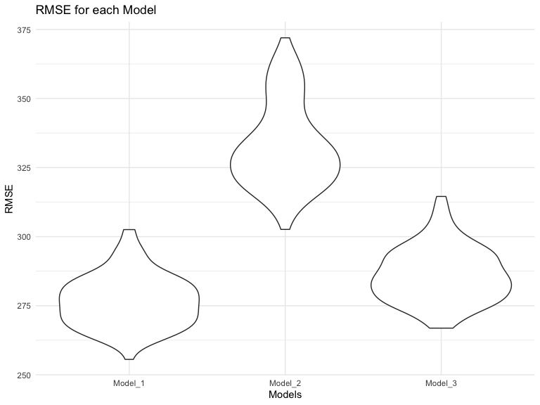

p8105\_hw6\_cm3928
================
Clement Mugenzi
11/20/2019

# Problem 1

``` r
weight_df = 
  read_csv("Data/birthweight.csv") %>% 
  janitor::clean_names() %>%
  rename(gender = babysex, momwt = delwt, momrace = mrace, dadrace = frace,
         avg_smokes = smoken) %>% 
  mutate(
    gender = recode(gender, "1" = "Male", "2" = "Female"),
    dadrace = recode(dadrace, "1" = "White", "2" = "Black", "3" = "Asian",
                     "4" = "Puerto Rican", "8" = "Other", "9" = "Unknown"),
    momrace = recode(momrace, "1" = "White", "2" = "Black", "3" = "Asian",
                     "4" = "Puerto Rican", "8" = "Other"),
    malform = recode(malform, "0" = "Absent", "1" = "Present"),
    gender = factor(gender, levels = c("Male", "Female")),
    dadrace = factor(dadrace, levels = c("White", "Black", "Asian",
                                         "Puerto Rican", "Other",
                                         "unknown")),
    momrace = factor(momrace, levels = c("White", "Black", "Asian",
                                         "Puerto Rican", "Other")),
    malform = factor(malform, levels = c("Absent", "Present"))) %>% 
  arrange(gender) %>% view()
```

    ## Parsed with column specification:
    ## cols(
    ##   .default = col_double()
    ## )

    ## See spec(...) for full column specifications.

**Model-building Process:**

Before deciding what predictors to include in my model, I first fitted
the model with all independent variables to determine which ones had a
significant p-value, meaning independnt variables directly affecting the
baby’s birthweight. Then I fitted the model using the selected
predictors.

``` r
bwt_lm = lm(bwt ~ gaweeks + avg_smokes + bhead + blength +
              gender + momrace, data = weight_df)
summary(bwt_lm)
```

    ## 
    ## Call:
    ## lm(formula = bwt ~ gaweeks + avg_smokes + bhead + blength + gender + 
    ##     momrace, data = weight_df)
    ## 
    ## Residuals:
    ##      Min       1Q   Median       3Q      Max 
    ## -1132.16  -187.84    -7.64   177.53  2439.90 
    ## 
    ## Coefficients:
    ##                       Estimate Std. Error t value Pr(>|t|)    
    ## (Intercept)         -5790.9874   100.3077 -57.732  < 2e-16 ***
    ## gaweeks                12.3131     1.4836   8.300  < 2e-16 ***
    ## avg_smokes             -4.2275     0.5957  -7.097 1.48e-12 ***
    ## bhead                 135.9807     3.4958  38.898  < 2e-16 ***
    ## blength                78.7124     2.0366  38.648  < 2e-16 ***
    ## genderFemale           31.5609     8.6232   3.660 0.000255 ***
    ## momraceBlack         -138.5887     9.3606 -14.806  < 2e-16 ***
    ## momraceAsian         -116.7343    42.9679  -2.717 0.006618 ** 
    ## momracePuerto Rican  -136.9243    19.0024  -7.206 6.78e-13 ***
    ## ---
    ## Signif. codes:  0 '***' 0.001 '**' 0.01 '*' 0.05 '.' 0.1 ' ' 1
    ## 
    ## Residual standard error: 278.1 on 4333 degrees of freedom
    ## Multiple R-squared:  0.7056, Adjusted R-squared:  0.7051 
    ## F-statistic:  1298 on 8 and 4333 DF,  p-value: < 2.2e-16

## Plot of Residuals against Fitted values

**Adding Residuals and Fitted values to the dataframe using modelr:**

``` r
weight_df1 = add_predictions(weight_df, bwt_lm)
weight_df2 = add_residuals(weight_df, bwt_lm)
weight_df = left_join(weight_df1, weight_df2)
```

    ## Joining, by = c("gender", "bhead", "blength", "bwt", "momwt", "fincome", "dadrace", "gaweeks", "malform", "menarche", "mheight", "momage", "momrace", "parity", "pnumlbw", "pnumsga", "ppbmi", "ppwt", "avg_smokes", "wtgain")

``` r
weight_df %>% 
  ggplot(aes(x = pred, y = resid)) + 
  geom_point() + 
  geom_smooth(color = "red", se = FALSE) +
  geom_hline(yintercept = 0) +
  labs(
    title = "Residuals against Fitted Values",
    x = "Fitted Values",
    y = "Residuals")
```

    ## `geom_smooth()` using method = 'gam' and formula 'y ~ s(x, bs = "cs")'


**Building two other models:**

1.  First Model:

One using length at birth and gestational age as predictors (main
effects only)

``` r
bwt_lm1 = lm(bwt ~ gaweeks + blength, data = weight_df)
summary(bwt_lm1)
```

    ## 
    ## Call:
    ## lm(formula = bwt ~ gaweeks + blength, data = weight_df)
    ## 
    ## Residuals:
    ##     Min      1Q  Median      3Q     Max 
    ## -1709.6  -215.4   -11.4   208.2  4188.8 
    ## 
    ## Coefficients:
    ##              Estimate Std. Error t value Pr(>|t|)    
    ## (Intercept) -4347.667     97.958  -44.38   <2e-16 ***
    ## gaweeks        27.047      1.718   15.74   <2e-16 ***
    ## blength       128.556      1.990   64.60   <2e-16 ***
    ## ---
    ## Signif. codes:  0 '***' 0.001 '**' 0.01 '*' 0.05 '.' 0.1 ' ' 1
    ## 
    ## Residual standard error: 333.2 on 4339 degrees of freedom
    ## Multiple R-squared:  0.5769, Adjusted R-squared:  0.5767 
    ## F-statistic:  2958 on 2 and 4339 DF,  p-value: < 2.2e-16

2.  Second Model:

a model that uses head circumference, length, sex, and all interactions
(including the three-way interaction) to test for any interaction that
might be present.

``` r
bwt_lm2 = lm(bwt ~ bhead * blength + blength * gender + gender * bhead +
                bhead * blength * gender, data = weight_df)
summary(bwt_lm2)
```

    ## 
    ## Call:
    ## lm(formula = bwt ~ bhead * blength + blength * gender + gender * 
    ##     bhead + bhead * blength * gender, data = weight_df)
    ## 
    ## Residuals:
    ##      Min       1Q   Median       3Q      Max 
    ## -1132.99  -190.42   -10.33   178.63  2617.96 
    ## 
    ## Coefficients:
    ##                              Estimate Std. Error t value Pr(>|t|)    
    ## (Intercept)                -7176.8170  1264.8397  -5.674 1.49e-08 ***
    ## bhead                        181.7956    38.0542   4.777 1.84e-06 ***
    ## blength                      102.1269    26.2118   3.896 9.92e-05 ***
    ## genderFemale                6374.8684  1677.7669   3.800 0.000147 ***
    ## bhead:blength                 -0.5536     0.7802  -0.710 0.478012    
    ## blength:genderFemale        -123.7729    35.1185  -3.524 0.000429 ***
    ## bhead:genderFemale          -198.3932    51.0917  -3.883 0.000105 ***
    ## bhead:blength:genderFemale     3.8781     1.0566   3.670 0.000245 ***
    ## ---
    ## Signif. codes:  0 '***' 0.001 '**' 0.01 '*' 0.05 '.' 0.1 ' ' 1
    ## 
    ## Residual standard error: 287.7 on 4334 degrees of freedom
    ## Multiple R-squared:  0.6849, Adjusted R-squared:  0.6844 
    ## F-statistic:  1346 on 7 and 4334 DF,  p-value: < 2.2e-16

**Comparison:**

I will use the `crossv_mc` function from `modelr` to split `weight_df`
into a train (80%) and test (20%) dataframes.

``` r
cv_df =
  crossv_mc(weight_df, 100) %>% 
  mutate(
    train = map(train, as_tibble),
    test = map(test, as_tibble))
```

I will then `map` the three built models above on the train dataframe,
then also use `map2_dbl` to map the models to the `test` dataframe in an
effort to generate the `Root mean squared errors` to help me make the
decision of which of the three models is superior, meaning which model
produces minimum `RMSE`.

``` r
cv_df = 
  cv_df %>% 
  mutate(bwt_lm = map(train, ~bwt_lm),
         bwt_lm1 = map(train, ~bwt_lm1),
         bwt_lm2 = map(train, ~bwt_lm2)) %>% 
  mutate(rmse_Model_1 = map2_dbl(bwt_lm, test, ~rmse(model = .x, data = .y)),
         rmse_Model_2 = map2_dbl(bwt_lm1, test, ~rmse(model = .x, data = .y)),
         rmse_Model_3 = map2_dbl(bwt_lm2, test, ~rmse(model = .x, data = .y)))
```

Using a visualization method, I can now choose which model is superior.

``` r
cv_df %>% 
  select(starts_with("rmse")) %>% 
pivot_longer(
    everything(),
    names_to = "model", 
    values_to = "rmse",
    names_prefix = "rmse_") %>% 
  mutate(model = fct_inorder(model)) %>% 
  ggplot(aes(x = model, y = rmse)) + 
  geom_violin() +
  labs(
    title = "RMSE for each Model",
    x = "Models",
    y = "RMSE")
```



Therefore, I will choose `Model_1` that predicts the baby’s birth weight
using gestational age in weeks, the average number of cigarettes smoked
per day during pregnancy, baby’s head circumference at birth, baby’s
length at birth, baby’s sex, and finally the mother’s race as its
predictor variables.

# Problem 2
